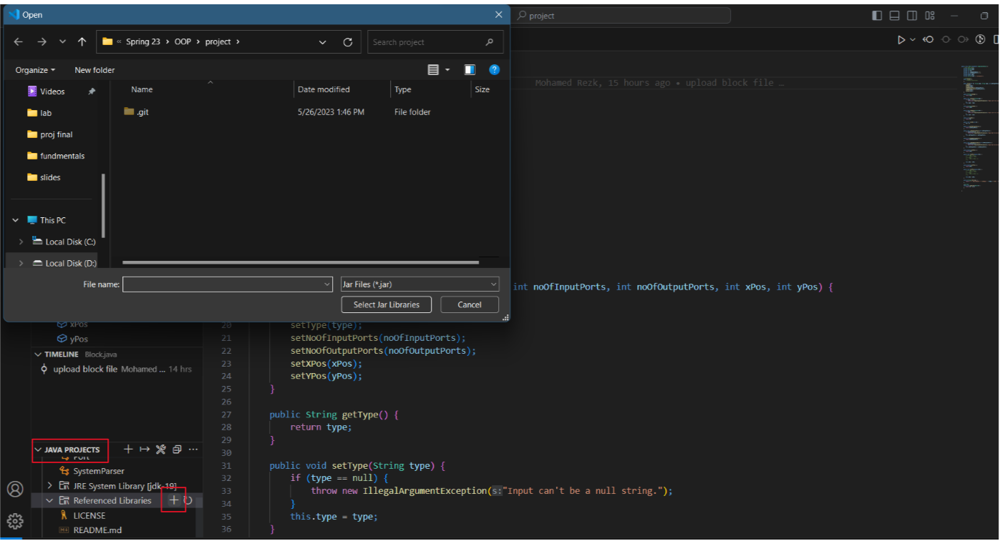
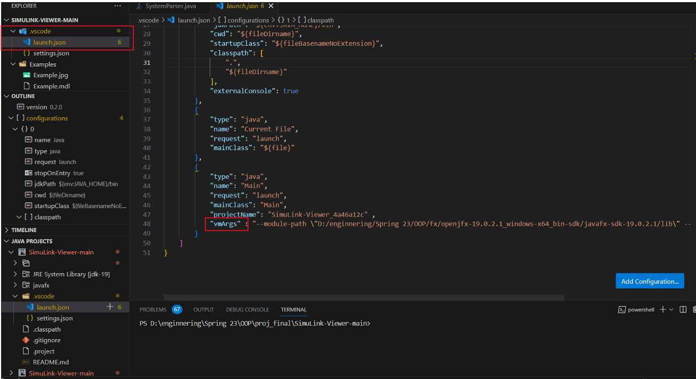
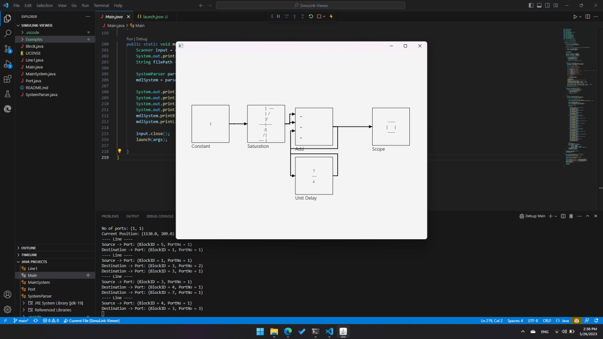

# SimuLink-Viewer
## Team Members

Names | id
----- | ----
Mohamed Yaser Elsaid Mahmoud | 2001226
Mahmoud Mohamed Mahmoud Ahmed | 2001261
Mahmoud Mohamed Ali Soliman  | 2001866
Mohamed Mahmoud Rezk Gaber | 2002114
Yassa Seifen Ayed Helmy | 2001307

## implementaion 
- in this program we first take an mdl file as an input and check if this file is a valid file with valid extention
- we proceed to parse the xml file extracting its blocks and lines using functions we implemented in the *** SystemPaser ***

``` bash
  data extract from there 
  blocks ---> their number and order then keep track of it in its designated class
  ports ---> their source and destination are perserved in the port class
  lines ---> their source destination and direction are perserved in line class
``` 
- After extracting needed data using javafx we started building the gui
- we visualize this data using a main scene which lies under it panes containg blocks and lines
- positions of clocks are fixed and line direction is claculated and its turns are specified

## usage 
for vscode :
- open folder in the vscode
- in java projects tap go to refrenced libraries\

- select the java fx files (java fx 20 is recomendded)
- the in (.vs code folder) select lunch.json and go to the end of the file\

- in "vmArgs" write you javafx source 
- *** run the project ***
## output using example files provided

